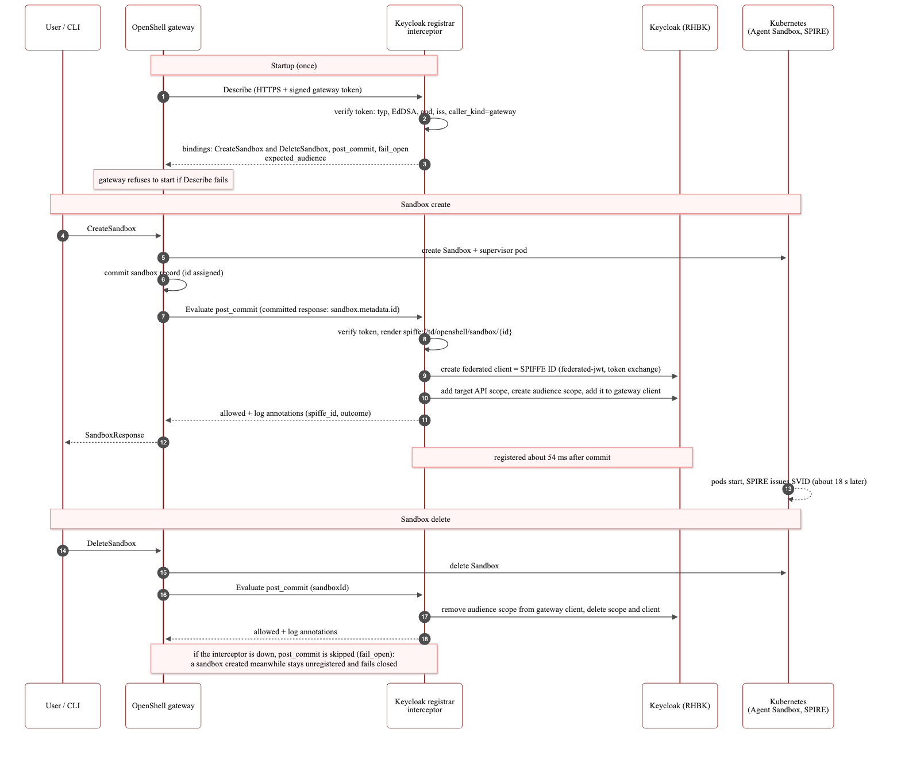

# Let agents call your APIs as the user, with no credentials in the sandbox

> **Midstream Documentation**
>
> Validated end to end; versions in [What was validated](../README.md#what-was-validated-and-its-support-status).
> Several components are Technology Preview. Do not use in production.

> [!IMPORTANT]
> OpenShell runs on Red Hat product-built images (`quay.io/opendatahub/odh-openshell-*:v0.1.2-rhaiv.5`);
> the full path below passed on them on 2026-10-06. The registrar interceptor is
> still built from source with a community Rust builder image; replace it with a
> product-built image once one exists. See
> [Images used in this repository](../README.md#images-used-in-this-repository).

An agent in an OpenShell sandbox calls an internal API. The API sees the **user**
who owns the sandbox and the **sandbox's own identity**, and the sandbox never
holds a credential:

```json
{
  "preferred_username": "alice",
  "azp": "spiffe://openshell.local/openshell/sandbox/openshell.os-supervisor-2d49346f-e70c-4d76-9452-b3470314b64b.2d49346f-e70c-4d76-9452-b3470314b64b",
  "aud": "whoami-api"
}
```

Six scripts set this up. Each is safe to re-run. To run them all at once:

```shell
make token-exchange   # preflight, then steps 0 to 5 (about 4 minutes)
make try-it           # step 6
```

After [User authentication](02-user-auth.md) (`make user-auth`), both flows share one Keycloak issuer, its HTTPS Route, and the gateway refuses anonymous callers. Run the demo with the admin CLI entry:

```shell
export OPENSHELL_GATEWAY=<namespace>   # the CLI entry make user-auth registers
export OPENSHELL_OIDC_CLIENT_SECRET="$(oc -n <namespace> get secret openshell-automation-oidc -o jsonpath='{.data.client-secret}' | base64 -d)"
openshell gateway login "$OPENSHELL_GATEWAY"
make try-it
```

The rest of this page walks through the steps one at a time.

## Before you start

Check them with `./scripts/preflight.sh --token-exchange`. You need:

- OpenShell installed with [Get started with OpenShell on OpenShift](01-install.md), and the `openshell` CLI connected to it.
- **Zero Trust Workload Identity Manager** 1.1.1 (Software Catalog, channel `stable-v1`) with a trust domain configured, for example `openshell.local`. See the [ZTWIM documentation](https://docs.redhat.com/en/documentation/openshift_container_platform/4.20/html/security_and_compliance/zero-trust-workload-identity-manager).
- Pull access to `registry.redhat.io` for the Red Hat build of Keycloak image (the default global pull secret is enough).

The scripts default to namespace `openshell`. To use another one, set it first:

```shell
export OPENSHELL_NAMESPACE=my-namespace
```

## Step 0: Turn on SPIFFE in OpenShell

```shell
OPENSHELL_ENABLE_SPIFFE=true ./scripts/deploy-openshell.sh
```

This upgrades the release with `server.providerTokenGrants.spiffe.enabled=true`,
which mounts the SPIFFE Workload API into the gateway and sandbox supervisor pods.

## Step 1: Fix the ZTWIM OIDC discovery provider

```shell
./scripts/token-exchange/01-fix-ztwim-oidc.sh
```

Expected: `ZTWIM is Ready`.

ZTWIM 1.1.1 tells SPIRE to ignore `openshift-*` namespaces, which includes its own
`openshift-ztwim` namespace, so its OIDC discovery provider never gets an identity
and crash-loops. Keycloak needs that endpoint to verify sandbox identities. The
script registers the provider with one `ClusterStaticEntry` per worker node. Re-run
it after adding or replacing worker nodes. Details, evidence, and the suggested fix:
[ZTWIM 1.1.1 OIDC discovery provider never becomes ready](../reference/known-issues/ztwim-oidc-discovery-provider.md).

## Step 2: Give each sandbox its own SPIFFE ID

```shell
./scripts/token-exchange/02-sandbox-spiffe-ids.sh
```

Every sandbox supervisor gets `spiffe://<trust-domain>/openshell/sandbox/<namespace>.<pod-name>.<sandbox-id>`,
the form Gordon Sim proposed upstream in [NVIDIA/OpenShell#3100](https://github.com/NVIDIA/OpenShell/pull/3100).
The namespace and pod name come from the pod itself, so a pod that only copies the
`openshell.ai/sandbox-id` annotation gets a different ID, with no Keycloak client.
The agent's own container never gets access to SPIFFE credentials.

## Step 3: Run Keycloak

```shell
./scripts/token-exchange/03-deploy-keycloak.sh
```

Starts Red Hat build of Keycloak 26.6 with SPIFFE client authentication enabled
(`--features=spiffe,client-auth-federated`, Technology Preview). It runs in dev mode
with an in-memory database, for evaluation only. In production, use the Red Hat
build of Keycloak operator (channel `stable-v26.6` or later) with the same features.
Keycloak 26.0 does not support SPIFFE.

To use an existing Keycloak 26.4 or later instead, skip this step and set
`KEYCLOAK_NAMESPACE` to its namespace.

## Step 4: Configure the realm

```shell
./scripts/token-exchange/04-configure-realm.sh
```

Creates the `openshell` realm, the SPIFFE identity provider, the gateway's client,
the target API (`whoami-api` by default, set `TARGET_API` to change it), a demo
user `alice`, and a service account for step 5. Generated passwords are stored in
Secrets in your namespace, never printed.

## Step 5: Register sandboxes in Keycloak automatically

```shell
./scripts/token-exchange/05-deploy-registrar.sh
```

Expected: `gateway connected to the interceptor`.

Keycloak needs one client per sandbox identity. The **keycloak-registrar**
[gateway interceptor](../interceptors/keycloak-registrar/) creates it when OpenShell
creates a sandbox and deletes it when the sandbox is deleted. The script builds the
interceptor image on your cluster from this repository, deploys it, and registers it
with the gateway.



On the validation cluster the Keycloak client existed 54 ms after OpenShell committed
the sandbox, about 18 seconds before the sandbox was ready.

> [!NOTE]
> The OpenShell Helm chart has no interceptor settings yet, so the script edits the
> gateway's `gateway.toml` ConfigMap and mounts the OpenShift service CA. Any later
> `helm upgrade`, including `deploy-openshell.sh`, resets them and prints a reminder.
> Re-run this step afterwards; `make token-exchange` does it for you.

## Step 6: Try it

```shell
./scripts/token-exchange/06-try-it.sh
```

The script deploys a `whoami-api` that verifies Keycloak tokens, gives OpenShell a
provider holding Alice's token, starts a sandbox, and calls the API from inside it
with plain `curl`. You should see the JSON at the top of this page.

What happened on that call:

1. `curl` in the sandbox sent a request with no credentials.
2. The sandbox supervisor intercepted it and asked the gateway to exchange Alice's
   stored token. The gateway proved its identity to Keycloak with its SPIFFE
   credential and received a token addressed to this sandbox.
3. The supervisor proved the sandbox's identity to Keycloak and exchanged that token
   for one scoped to `whoami-api`.
4. The supervisor added the token to the request. Alice's original token never
   entered the sandbox.

Clean up the demo sandbox with `openshell sandbox delete token-exchange-demo`.

## Use it with your own API

Set `TARGET_API` to your API's Keycloak client ID before steps 4 to 6, and make your
API validate tokens against the realm's JWKS
(`<keycloak>/realms/openshell/protocol/openid-connect/certs`) with audience
`TARGET_API`. Do not use token introspection from a separate client: Keycloak 26.6
only introspects tokens that include the calling client in their audience.

In the provider profile, list the endpoints your agent calls and the binaries
allowed to call them. Do not set `tls: none`; current OpenShell rejects it.

## Troubleshooting

| Symptom | Cause | Fix |
|---|---|---|
| Every call returns HTTP 502 after a while; Keycloak logs `subject_token validation failure` | The user's Keycloak session expired. Stored tokens only work while the session is alive. Step 4 sets a 10-hour idle timeout. | Refresh the token: `openshell provider update <provider> --credential subject_token=<new token>`. It applies to running sandboxes. |
| First call from a new sandbox returns HTTP 502; Keycloak logs `Audience not found` | The sandbox's Keycloak client does not exist: the interceptor was down when the sandbox was created, or it could not reach Keycloak (its log shows `keycloak registration failed`) | Check `oc logs deploy/keycloak-registrar`, then recreate the sandbox. |
| Gateway fails to start after step 5 | The gateway cannot reach the interceptor at startup. | Check `oc get pods -l app=keycloak-registrar` and the gateway log for `interceptor`. |
| Python HTTPS calls fail with `Operation not supported` | RHCOS kernel limitation. | See Known Limitations in the [install guide](01-install.md#known-limitations). |

## Known limitations

- If the interceptor is down when a sandbox is created, that sandbox is never
  registered. Recreate it once the interceptor is back.
- Keycloak's SPIFFE support and the Red Hat build of Agent Sandbox are Technology
  Preview.
- The interceptor is not yet part of OpenShell or a Red Hat product.
